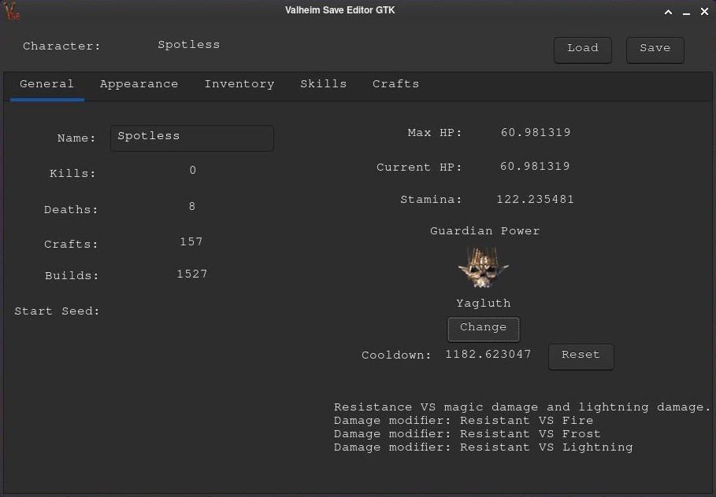

# Valheim Save Editor GTK

Valheim character editor made for Linux using gtkmm.
At this time it has only basic functionality like changing name, appeareance, gender, Guardian Power and cooldown. I'll add more features when I will have time...
Might break your save, use at own risk.

# Usage
For Windows build using MSYS2 or just download exe from release page. You need to have GTK 3 runtime enviroment installed or it wont work. One of the packages have installer included or you can get it from here: https://github.com/tschoonj/GTK-for-Windows-Runtime-Environment-Installer

For linux clone repository, make and run. Remember to have gtkmm-3.0, wich you should by default anyway.

# Build process
	Doesn't require anything special. Be sure you have installed gtkmm-3.0, g++, make and pkg-config.

# Comming soon
	-Inventory editing and managing
	-Crafting recipes
